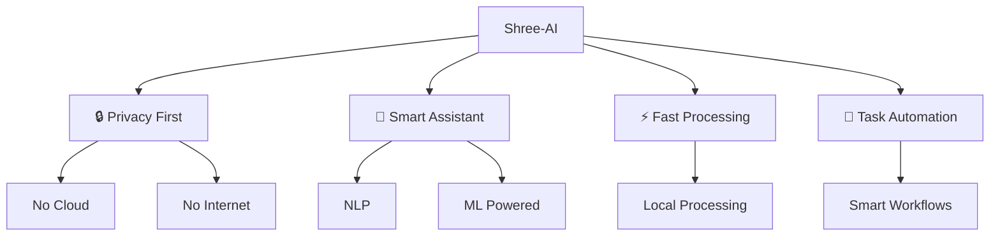
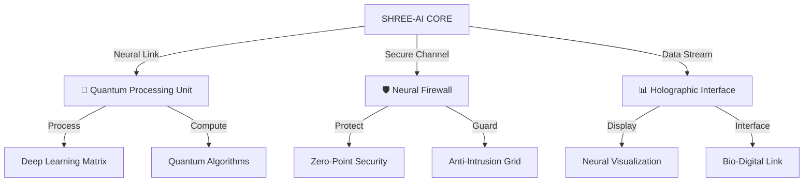

<p align="center">
  
</p>

```ascii
█▀ █░█ █▀█ █▀▀ █▀▀   ▄▀█ █
▄█ █▀█ █▀▄ ██▄ ██▄   █▀█ █
```

<div align="center">

### 🕉️ _Intelligence Enlightened at local system without internet_ 🧬

[](https://github.com/UDDITwork/Shree-AI)
[](https://github.com/UDDITwork/Shree-AI)
[](https://github.com/UDDITwork/Shree-AI)
</div>
<p align="center">
  
</p>

<div align="center">

[](https://github.com/UDDITwork/Shree-AI/stargazers)
[](https://github.com/UDDITwork/Shree-AI/network/members)
[](https://twitter.com/UdditRise)
[](https://github.com/UDDITwork/Shree-AI)

### 🌌 _Experience Intelligence, Privately_ 🔐

</div>

---

<div align="center">

## 🎯 What Makes Shree-Ai Special? 🚀

</div>



## 🌟 Features That Will Blow Your Mind 🌟

<table>
<tr>
<td width="50%">

### 🛡️ Privacy Shield
- 🔐 100% Offline Processing
- 🏠 Local Data Storage
- 🚫 No Cloud Dependencies
- 🔍 Zero Data Leakage

</td>
<td width="50%">

### 🤖 Smart Assistant
- 🧠 Advanced NLP
- 📊 Data Analysis
- 🎯 Task Automation
- 🔄 Self Learning

</td>
</tr>
</table>

## 🚀 Installation Magic ✨

```bash
# Clone this magical repository 🧙‍♂️
git clone https://github.com/UDDITwork/Shree-AI.git

# Enter the enchanted directory 🏰
cd Shree-AI

# Install the mystical dependencies 📚
pip install -r requirements.txt

# Launch your personal assistant 🚀
python main.py
```

## 💫 System Requirements 

<table>
<tr>
<td>

### Minimum 🌱
- 🖥️ CPU: Intel i5/AMD Ryzen 5
- 💾 RAM: 8GB
- 💿 Storage: 10GB
- 🎮 GPU: Optional

</td>
<td>

### Recommended 🌟
- 🖥️ CPU: Intel i7/AMD Ryzen 7
- 💾 RAM: 16GB
- 💿 Storage: 20GB
- 🎮 GPU: 4GB+ VRAM

</td>
</tr>
</table>

## 🎨 Amazing Things You Can Do 

<div align="center">

| 📊 Analysis | 📝 Documents | 🤖 Automation |
|------------|-------------|---------------|
| Data Processing | Text Analysis | Task Management |
| Pattern Recognition | PDF Processing | Workflow Automation |
| Trend Analysis | Document Summary | Smart Scheduling |

</div>

## 🌈 Quick Start Guide

1. 🚀 Launch Shree-AI
2. 📂 Upload your documents
3. 🎯 Select your task
4. ✨ Get results instantly!

## 🛠️ Tech Stack 

<div align="center">

[](https://www.python.org/)
[](https://www.tensorflow.org/)
[](https://pytorch.org/)
[](https://scikit-learn.org/)

</div>

## 💖 Support & Community

<div align="center">

| 📱 Contact | 🔗 Link |
|------------|---------|
| 📧 Email | [udditalerts247@gmail.com](mailto:udditalerts247@gmail.com) |
| 🐦 Twitter | [@UdditRise](https://twitter.com/UdditRise) |
| 💻 GitHub | [UDDITwork](https://github.com/UDDITwork) |
| 📞 Phone | +91 7456886877 |

</div>

## 🌟 Star History

[](https://github.com/UDDITwork/Shree-AI/stargazers)

## 🤝 Contributors

<div align="center">

Thanks to all our amazing contributors! 🎉

<a href="https://github.com/UDDITwork/Shree-AI/graphs/contributors">
  
</a>

</div>

## 📜 License

<div align="center">

Released under the [Extranos License](LICENSE) ⚖️

```
Made with 💖 by UDDIT
```
### 🌌 We aspire to achieve iot integration and real time processing like Jarvis of iron man in upcoming years_ 🧬
<p align="center">
  
</p>

<div align="center">

[](https://github.com/UDDITwork/Shree-AI)
[](https://github.com/UDDITwork/Shree-AI)
[](https://github.com/UDDITwork/Shree-AI)
[](https://github.com/UDDITwork/Shree-AI)

```ascii
█▀ █░█ █▀█ █▀▀ █▀▀ ▄▄ ▄▀█ █
▄█ █▀█ █▀▄ ██▄ ██▄ ░░ █▀█ █
```

### 🌌 _Quantum-Powered Intelligence Matrix_ 🧬
</div>

---

<div align="center">

## 🎯 ARCHITECTURE OVERVIEW 🚀

</div>



## 🌟 WHAT WE WISH TO ACHIEVE IN UPCOMING YEARS  🌟

<table>
<tr>
<td width="50%">

### 🌌 NEURAL CORE
- 🧬 Quantum Processing
- 🔮 Predictive Matrix
- 🌠 Neural Evolution
- ⚡ Photonic Computing

</td>
<td width="50%">

### 🛸 HOLOGRAPHIC INTERFACE
- 👁️ Neural Visualization
- 🎯 Bio-Sync Technology
- 🌈 Quantum Rendering
- 🔵 Holographic Display

</td>
</tr>
</table>

## ⚡ INITIALIZATION SEQUENCE ⚡

```bash
# Initialize Quantum Core 🌌
$ quantum-init --core shree-ai

# Activate Neural Matrix 🧬
$ neural-sync --establish-link

# Launch Holographic Interface 🌠
$ holo-launch --display-matrix

# Engage System 🚀
$ shree-ai --quantum-mode
```

## 💫 QUANTUM REQUIREMENTS 

<table>
<tr>
<td>

### BASELINE MATRIX 🌱
- 🧬 QPU: Quantum Processing Unit v1
- 💠 Memory: 8QB Quantum RAM
- 🌌 Storage: Neural Matrix 10TB
- ⚡ Power: Quantum Core Basic

</td>
<td>

### VURRENT VERSION IS DOWNLOADABLE AND SIMPLE TO USE , BUT NOT FOR LOW-iQ idiots 🌟
- 🧬 CPU: Simple
- 💠 Memory: 8 GB RAM
- 🌌 Storage: LOCAL FILES
- ⚡ Power: Simple computer , no advanced requirements

</td>
</tr>
</table>

## 🎯 CAPABILITIES THAT WE ENVISION FOR THE FUTURE VERSIONS 

<div align="center">

| 🧬 Analysis | 🌌Processing | ⚡ Bio-Digital Sync |
|-------------------|---------------------|-------------------|
| Data Matrix | Neural Network Fusion | Bio-Digital Interface |
| Temporal Analysis | Quantum Computation | Sync Protocol |
| Reality Mapping | Holographic Processing | Entanglement |

</div>

## 🌈 ACTIVATION PROTOCOL

1. 🚀 Initialize 
2. 🧬 Establish Link by download and use of CMD or POWERSHELL
3. 🌌 Sync Local Interface
4. ⚡ Engage with Passion

## 🛸 TECHNOLOGY MATRIX 

<div align="center">

[]()
[]()
[]()
[]()

</div>

## 🌌 NEURAL COMMAND CENTER

<div align="center">

| 📡 Communication Matrix | 🔗 Neural Link |
|----------------------|---------------|
| 🧬 Mail | [udditalerts247@gmail.com](mailto:udditalerts247@gmail.com) |
| 🌌 Social | [@UdditRise](https://twitter.com/UdditRise) |
| ⚡ Code Matrix | [UDDITwork](https://github.com/UDDITwork) |
| 📱 Call for info | +91 7456886877 |

</div>

## ⚡ NETWORK GROWTH

[](https://github.com/UDDITwork/Shree-AI/stargazers)

## 🧬 COLLABORATORS

<div align="center">

Neural Network Contributors 🌌

<a href="https://github.com/UDDITwork/Shree-AI/graphs/contributors">
  
</a>

</div>

## 📜 Extranos LICENSE PROTOCOL

<div align="center">

Secured under [Extranos Protocol](LICENSE) ⚛️

```ascii
Engineered with Passion and vision of a personal friend by UDDIT
```

</div>

<p align="center">
  
</p>

</div>

<p align="center">
  
</p>
